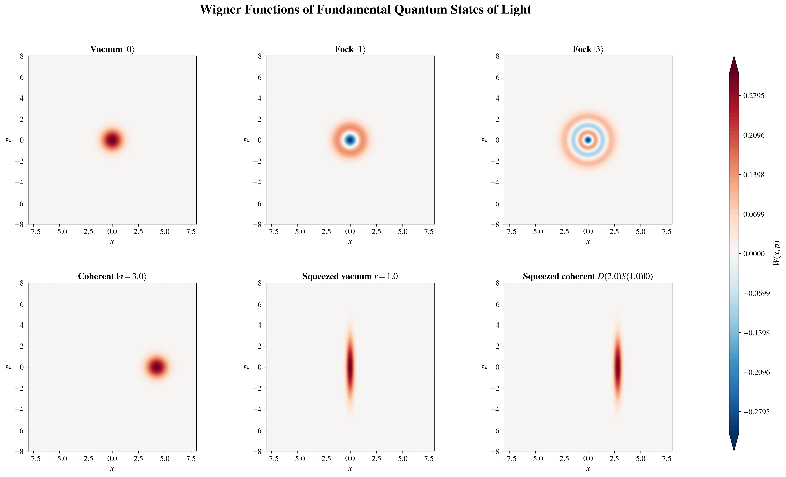
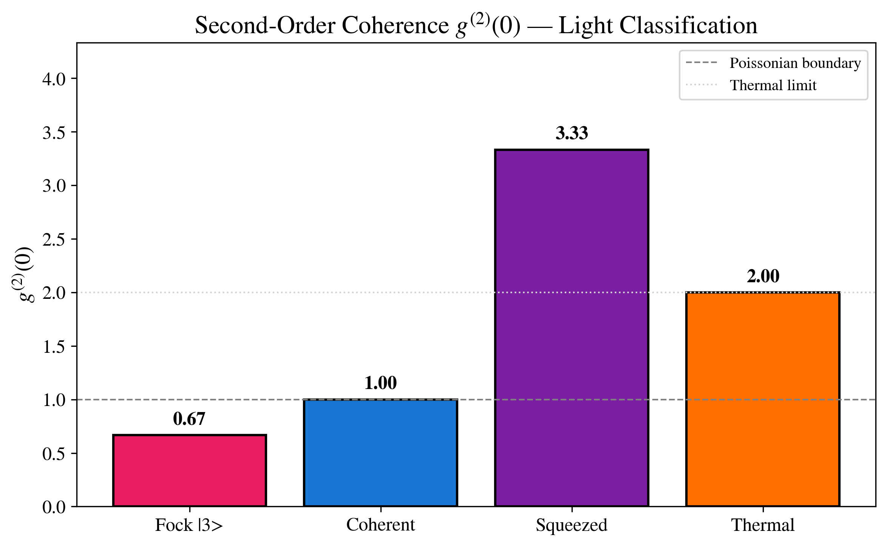
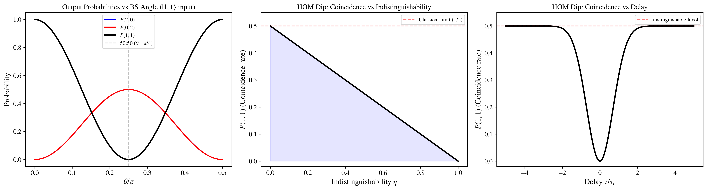
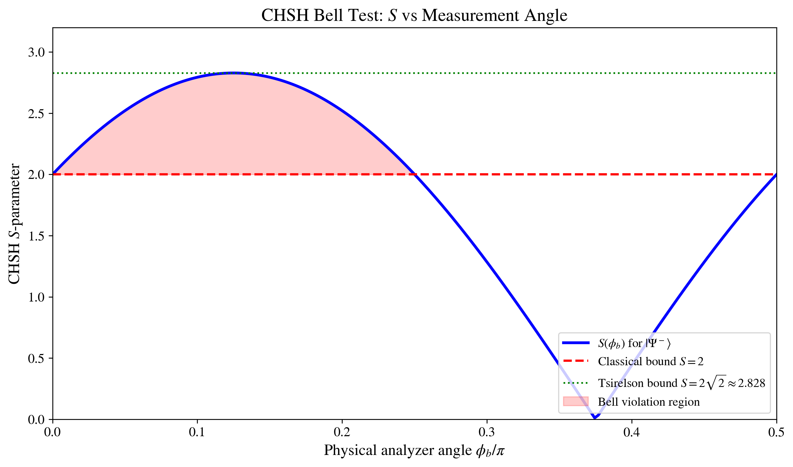

# Quantum States of Light

[](https://python.org)
[](https://qutip.org)
[](LICENSE)
[](https://jupyter.org)

Computational quantum optics examples using Python and
[QuTiP](https://qutip.org). The repository constructs common quantum states of
light, computes photon statistics and Wigner functions, and simulates standard
two-mode experiments such as Hong-Ou-Mandel interference and CHSH Bell
violation.

## Scope

The project covers:

- Quantum state construction: Fock, coherent, squeezed vacuum, squeezed
  coherent, and thermal states.
- Photon statistics: photon-number distributions, zero-delay coherence
  g^2(0), and Mandel Q.
- Phase-space analysis: Wigner functions, normalization checks, and Wigner
  negativity.
- Two-mode optics: beam splitter transformations and Hong-Ou-Mandel
  interference.
- Entanglement diagnostics: Bell states, concurrence, and CHSH violation.
- Reproducibility: fixed dependency records, validation tests, and notebook
  verification.

## Key Results

### Wigner Function Gallery



Six phase-space portraits on a shared X,P convention, including Wigner
negativity for Fock states and Gaussian positivity for coherent,
squeezed-vacuum, and squeezed-coherent examples.

### Photon Statistics



Zero-delay photon-correlation regimes: antibunching, Poissonian light, and
bunching. The value of g^2(0) is a useful diagnostic, not a complete state
classifier.

### Hong-Ou-Mandel Interference



Identical photons at a 50:50 beam splitter show destructive two-photon
interference and a zero-coincidence dip at zero delay.

### Bell/CHSH Violation



The singlet-state CHSH calculation reaches S = 2 sqrt(2), exceeding the
local-realist bound while respecting no-signaling.

## Physics Background

The electromagnetic field in a cavity can be decomposed into normal modes, each
mode behaving as a quantum harmonic oscillator with Hamiltonian

```text
H = hbar omega (a_dag a + 1/2).
```

The creation and annihilation operators satisfy

```text
[a, a_dag] = 1
```

and generate the Fock-space basis used throughout the notebooks.

| State | Definition | g^2(0) | Key Property |
|-------|------------|--------|--------------|
| Fock \|n> | Number eigenstate | 1 - 1/n | Sub-Poissonian, non-classical |
| Coherent \|alpha> | D(alpha)\|0> | 1.0 | Poissonian photon statistics |
| Squeezed S(xi)\|0> | Squeezed vacuum | 3 + 1/<n> | Reduced uncertainty in one quadrature |
| Thermal rho_th | Mixed state | 2.0 | Super-Poissonian bunching |

<details>
<summary><strong>Extended Statistics Table</strong> (12 states, computed from code)</summary>

| State | <n> | Delta n | g^2(0) | Q | Wigner | Statistics |
|-------|----:|--------:|-------:|--:|--------|------------|
| Vacuum \|0> | 0.00 | 0.00 | - | - | nonnegative | - |
| Fock \|1> | 1.00 | 0.00 | 0.000 | -1.00 | negative | Sub-Poisson |
| Fock \|3> | 3.00 | 0.00 | 0.667 | -1.00 | negative | Sub-Poisson |
| Fock \|5> | 5.00 | 0.00 | 0.800 | -1.00 | negative | Sub-Poisson |
| Coherent alpha=1 | 1.00 | 1.00 | 1.000 | 0.00 | nonnegative | Poissonian |
| Coherent alpha=3 | 9.00 | 3.00 | 1.000 | 0.00 | nonnegative | Poissonian |
| Coherent alpha=5 | 25.00 | 5.00 | 1.000 | 0.00 | nonnegative | Poissonian |
| Squeezed r=0.5 | 0.27 | 0.83 | 6.683 | 1.54 | nonnegative | Super-Poisson |
| Squeezed r=1.0 | 1.38 | 2.56 | 3.724 | 3.76 | nonnegative | Super-Poisson |
| Thermal n_bar=1 | 1.00 | 1.41 | 2.000 | 1.00 | nonnegative | Super-Poisson |
| Thermal n_bar=3 | 3.00 | 3.46 | 2.000 | 3.00 | nonnegative | Super-Poisson |
| Thermal n_bar=5 | 5.00 | 5.48 | 2.000 | 5.00 | nonnegative | Super-Poisson |

</details>

